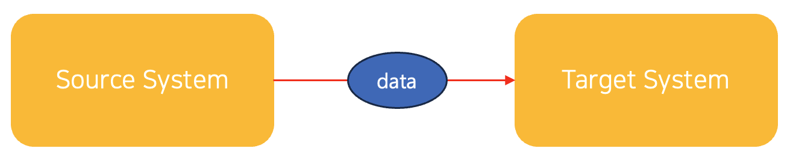
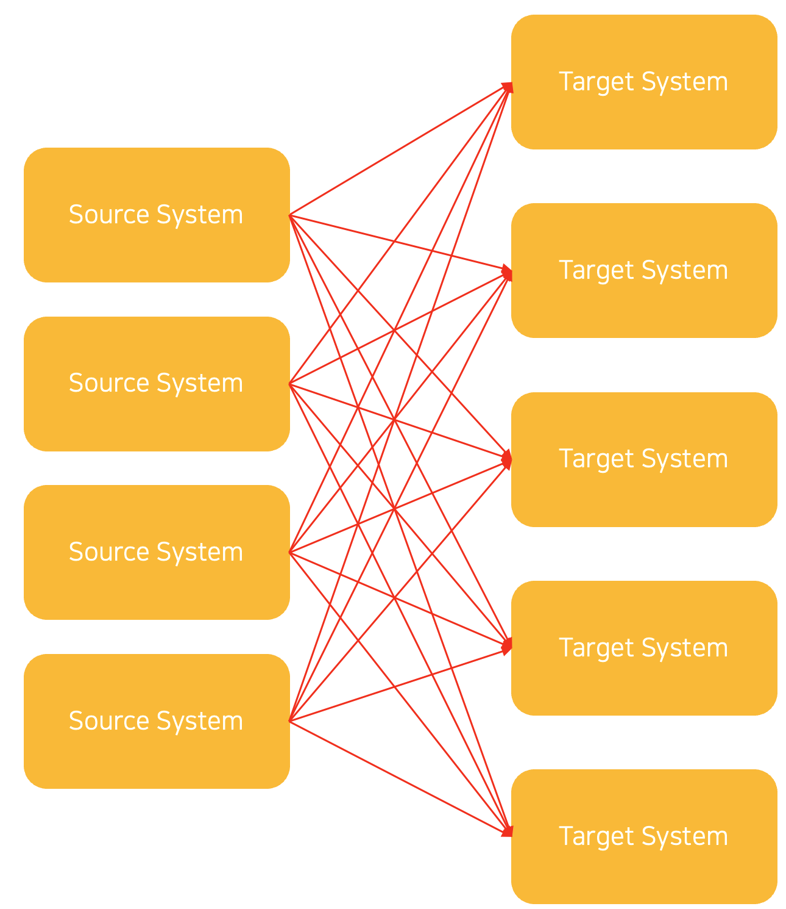
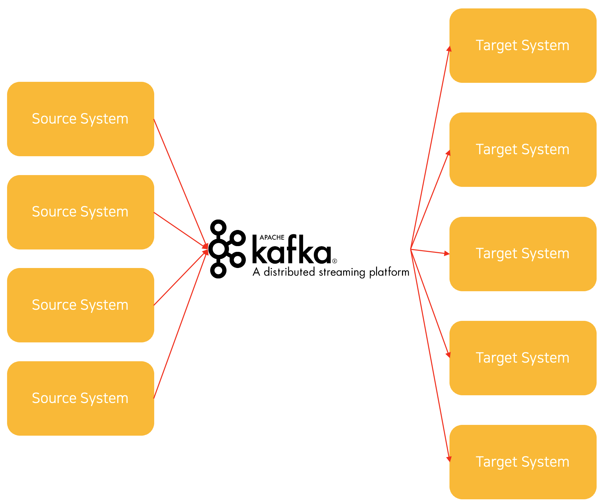

# Why we need to use Kafka?

---

## Kafka의 소개

Kafka란 무엇일까? 웹 백엔드 및 DevOps, MLOps에 관심이 있다면 쉽게 접해볼 키워드이다. Kafka는 Linked In 이라는 빅테크 기업에 의해 만들어졌다. 그리고 지금은 Confluent, IBM, Linked In과 같은 대기업들에 의해 오픈소스로 관리되고 있다.

우선 [Kafka 공식 홈페이지](https://kafka.apache.org)를 들어가서 가운데에 있는 소개글부터 읽어본다.

> > Apache Kafka is an open-source distributed event streaming platform used by thousands of companies for high-performance data pipelines, streaming analytics, data integration, and mission-critical applications.

단어들이 난해할 수 있다. 하지만 여기서 확실히 가져가야하는것은 `분산 이벤트 스트리밍 플랫폼` 이라는 것이다. 이 외에도 `데이터 파이프라인`, `스트리밍 분석`, `데이터 통합` 등의 단어들이 등장하는 것을 볼 수 있다. 앞으로 차차 이 단어들의 관점도 살펴볼 것이다.

## Kafka를 쓰는 이유는 무엇일까?

### Kafka를 사용하지 않는 경우

Kafka를 왜 사용할까? 그 이유를 자세히 알아보기 전에 데이터를 통합하는 측면에서 바라보아야 한다.

두가지의 시스템이 각각 하나씩 있다고 가정을 한다.

- Source System : Source System은 간단하게 데이터베이스라고 가정을 한다
- Target System : Target System은 Source System으로 부터 데이터를 받아와 동일한 데이터를 저장해야하는 시스템이라고 가정을 한다.

예를 들어 PostgreSQL에 저장된 데이터들을 Amazon S3에 Sink한다고 가정한다. 1차원적으로 해석했을때, 구조는 매우 간단하다. 코드를 작성하고 데이터를 받은 후 Transform을 진행한 후 저장을 하면 된다.

하지만 만약에 기업의 규모가 커진다고 가정을 하면, Source System의 수도 많아지고, Target System의 수도 많아진다. 예를 들어 4개의 Source System과 5개의 Target System이 위와 동일한 방식으로 Sink한다고 가정하자.

Source System은 정보를 모든 Target System으로 보내주어야 정상적인 정보공유(Sink)가 가능해 진다. 하지만 문제는 위의 시스템과 같이 구성되게 되면 총 20개의 통합 전략을 작성해야한다. 하지만 이는 현실적으로 간단한 문제가 아니다.

### 어떤 문제점이 있나?

1. Protocol 관련 문제
   시간이 지나며 기술이 변경됨에 따라 데이터를 TCP, HTTP, REST, FTP등 다양한 프로토콜을 통해 데이터를 전송하는 방식이 달라질 수 있다

2. 데이터 형식 문제
   데이터를 파싱하는 방법에 관련된 것이다. Binary, CSV, JSON등 다양한 방법이 있다.

3. 데이터의 형상(format) 변화
   만약 Source System 혹은 Target System에서 데이터 형상이 변화할 수 도 있는것이다

4. 부하의 증가
   모든 Target System은 각각의 Source System으로 부터 데이터를 불러오기 위해서 요청을 보낸다. Source System 혹은 Target System이 하나씩 추가될 때마다 부하는 증가될 수 밖에 없다.

## Kafka를 사용한 Decoupling

Kafka를 사용하면 위 문제점에서 Decoupling을 도입할 수 있다.

우선 Source System과 Target System의 존재는 동일하다. 위 시스템은 아래와 같이 동작하게 된다

1. Source System은 데이터 전송을 담당하게 되며, 이러한 행위를 `Produce`라고 정의합니다. 그리고 `Produce`한 데이터를 Kafka에 보내게 된다. 이 과정에서 **`데이터 스트림`** 이 생성되게 된다.
2. Target System이 Source System으로부터 데이터를 받기 위해서는 Kafka로부터 데이터를 받아온다. 그리고 이러한 행위를 `Consume`이라고 부른다.

위와 같이 Decoupling을 진행해 주면, Scaling하기에 더 좋은 조건이 만들어 지게 된다.

좀 더 자세히 Source System, Target System에는 어떤것들이 해당될 수 있을까? Source System은 웹사이트 이벤트 혹은 금융거래가 될 수 있다. 이 모든 것들은 위에서 말한 **데이터 스트림**이 형성되면서, 데이터가 실시간으로 생성된다. 그리고 그 데이터는 Kafka로 전송이 된다. 이 데이터들은 Target System인 데이터베이스, 분석시스템, 감사시스템 등에 전송이 되게 된다.

## Kafka의 장점

앞에서 설명한것들로는 체감이 안되겠지만, 전반적인 Kafka의 장점을 짚고 넘어가고자 한다. 이 장점은 뒤의 개념들을 정리하며 살펴본다.

1. Distributed, Fault Tolerance, Resilient Architecture(회복될 수 있는 구조)

2. Flexible in Scale-Out

- 추후 Broker를 Kafka 클러스터에 확장 가능

3. Low Latency : Less than 10ms

- Kafka를 실시간 시스템으로 부르는 이유
